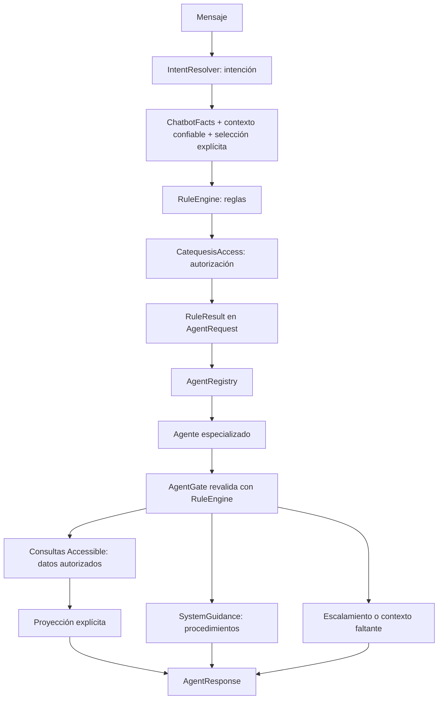

# Arquitectura multiagente determinista — fase 6B

## Objetivo y límites

Un agente es un componente PHP con responsabilidad de dominio acotada: prepara
datos autorizados, orientación o una respuesta de escalamiento. No es un usuario,
un rol, un proceso autónomo ni un proveedor de IA. Los seis agentes sirven a los
cinco roles usando la misma autoridad de dominio. No existe un agente por rol.



No se creó ChatbotService general, controlador, endpoint, interfaz, JavaScript,
IA, memoria ni tablas de conversaciones. No hay operaciones de escritura desde
chat. El código se puede invocar desde servicios PHP y pruebas. El contenedor
resuelve clases concretas; no se registra un binding global de interfaz Agent,
porque hay varias implementaciones seleccionadas explícitamente por el registro.

## Contratos y frontera de confianza

`Contracts/Agent` define `supports(ChatbotIntent): bool` y
`handle(AgentRequest): AgentResponse`. supports describe responsabilidad, **no
permiso**. Los agentes no reciben Illuminate Request ni el texto original.

AgentRequest es readonly. Agrupa `facts: ChatbotFacts` y `decision: RuleResult`.
Los facts contienen AccessContext, intención y los cuatro IDs opcionales ya
definidos en fase 5 (assignmentId, inscriptionId, studentId, evaluationId).
Así no se duplican ni pueden divergir campos de identidad/selección. No se añade
un array arbitrario de filtros. Su constructor es privado y la única factoría es
`AgentRequest::evaluate($facts, $engine)`: el resultado siempre lo produce el motor,
no un payload con un supuesto ALLOWED.

El consumidor DEBE obtener un AccessContext nuevo mediante AccessContextResolver
en cada operación. No reconstruirlo desde el mensaje, JSON, sesión conversacional
o una respuesta anterior. Ni esta factoría ni los agentes autentican al usuario:
la identidad del servidor sigue siendo la frontera de confianza de fase 3.

AgentGate reevalúa los mismos facts con RuleEngine antes del trabajo de cada agente,
incluso si se invoca handle directamente. No contiene una matriz de roles ni una
implementación alternativa de permisos. Una reasignación ocurrida después de crear
AgentRequest vuelve a denegarse. Los resultados no permitidos se traducen mediante
EscalationAgent. Un contexto en memoria antiguo no detecta una revocación de cuenta;
por eso la revalidación no sustituye resolver nuevamente identidad y estado.

## Registro y responsabilidades

| Intención/resultado | Agente | Comportamiento |
|---|---|---|
| VIEW_MY_GROUPS | GroupsAgent | Lista asignaciones accesibles, con proyección de grupo |
| VIEW_ATTENDANCE_LIST | GroupsAgent | Selección explícita y navegación al módulo Mi grupo existente |
| VIEW_GROUP_STUDENTS | StudentsAgent | Alumnos de la asignación seleccionada, nunca catálogo global |
| VIEW_EVALUATIONS | EvaluationsAgent | Evaluaciones del selector autorizado |
| HELP_SYSTEM | HelpAgent | Intenciones consultables según capacidades reales del contexto |
| VIEW_BOLETA autorizado | HelpAgent | Orientación/navegación a Boletas existente; no crea PDF ni devuelve boleta |
| Los once HOW_TO de fase 5 | AdministrationAgent | Solo instrucciones mantenidas en SystemGuidance |
| DENIED, ESCALATE, UNSUPPORTED | EscalationAgent | Respuesta segura y responsable recomendado cuando corresponda |
| MISSING_CONTEXT, AMBIGUOUS | EscalationAgent | Contexto requerido o aclaración/revisión de datos |

Excepción explícita del registro: MISSING_RESOURCE por assignmentId ausente para
alumnos o asistencia se entrega a StudentsAgent/GroupsAgent para ofrecer selección.
No se convierte en ALLOWED, ni autoriza consultar alumnos. La capacidad, estado,
periodo y comunidad ya fueron evaluados antes de que el motor emita ese código.
Los rechazos por contexto, rol o alcance nunca ofrecen opciones.

AgentRegistry solo selecciona una instancia. No ejecuta agentes, consultas ni
mensajes a personas. La llamada handle permanece explícita en el consumidor.

## Respuesta y proyecciones seguras

AgentResponse es readonly y contiene status, code, messageKey, data,
suggestedActions y metadata. Los agentes construyen arrays de escalares; no usan
Model::toArray ni serialización automática de relaciones. Los messageKey son
identificadores estables para una presentación futura, no traducciones ya conectadas
a una interfaz. Los pasos de orientación sí son textos españoles controlados.

| Proyección | Campos disponibles |
|---|---|
| Grupo/asignación | assignmentId, groupId, name, level, community, period |
| Alumno | id, fullName |
| Evaluación | student (id, fullName), unit, rubric, grade |

assignmentId identifica la opción; groupId no lo sustituye, ya que varias
asignaciones pueden compartir grupo. grade conserva el decimal de Eloquent, sin
recalcular notas ni inventar resúmenes finales. No se exponen User, password,
remember_token, identidad de tutores, teléfonos, fechas de nacimiento, información
sacramental, metadatos de base de datos ni claves internas innecesarias.

Statuses: OK, RESOURCE_SELECTION_REQUIRED y los resultados no permitidos del
motor (DENIED, ESCALATE, UNSUPPORTED, MISSING_CONTEXT, AMBIGUOUS). Los códigos
STUDENTS_READY, EVALUATIONS_READY, GUIDANCE_READY, HELP_READY y
ASSIGNMENT_SELECTION_REQUIRED distinguen las respuestas funcionales. En rechazos
se conservan los códigos del dominio, por ejemplo OUTSIDE_SCOPE.

No se devuelve HTML. Las acciones `navigate` contienen nombres de rutas GET
existentes y parámetros acotados, nunca instrucciones de escritura. Una interfaz
futura deberá escapar los nombres/valores que muestre y conservar la autorización
de los endpoints existentes. Contactar o solicitar aclaración son recomendaciones,
no comunicaciones efectuadas.

## Acceso a datos reales

- AssignmentOptions/GroupsAgent parten de AccessibleAsignaciones::for(context).
  Cargan únicamente columnas de la asignación y los nombres/fechas de sus relaciones
  vigentes; nunca cargan la relación catequista/User para responder.
- StudentsAgent parte de AccessibleAlumnos y reduce por una subconsulta de
  AccessibleInscripciones del grupo de la asignación visible y del periodo activo.
- EvaluationsAgent parte de AccessibleEvaluaciones y aplica AND con inscripciones
  accesibles. assignmentId reduce por grupo; inscriptionId, studentId o evaluationId
  reducen por ese recurso. Se conserva el contrato de un selector de fase 5, sin
  filtros SQL, nombres de columna ni IDs de comunidad arbitrarios.
- Las relaciones de presentación de evaluaciones (alumno, unidad, rubro) se cargan
  con columnas explícitas desde los padres previamente acotados por Accessible*.
  No se consulta una colección global para filtrarla por usuario después.

En producción las consultas utilizan la conexión MySQL/MariaDB configurada por
Laravel. No se accedió a la base local ni se añadieron datasets en los agentes.
Las pruebas reutilizan CatequesisWebTestCase, SQLite en memoria y su esquema mínimo.

Se conserva la política histórica de AccessibleEvaluaciones: periodo_id NULL hereda
el periodo de la inscripción autorizada; un periodo explícito ajeno queda excluido.
Las relaciones borradas y las inscripciones académicamente ambiguas siguen excluidas.
La pertenencia de alumnos al grupo conserva la política del dominio existente;
no se inventa un filtro comunitario adicional para catequistas.

Cada consulta recupera como máximo 101 filas y devuelve 100, en orden estable por
ID, con metadata.hasMore. No se afirma que el conteo parcial sea un total completo.
La paginación conversacional queda pendiente; no hay cursor ni selección automática.

## Selección e inconsistencia de datos

Ejemplo de salida para «muéstrame mis alumnos» sin assignmentId:

```json
{
  "status": "RESOURCE_SELECTION_REQUIRED",
  "code": "ASSIGNMENT_SELECTION_REQUIRED",
  "messageKey": "chatbot.select_assignment",
  "data": {"resourceType": "assignment", "options": []},
  "suggestedActions": [{"type": "select_resource", "resourceType": "assignment"}],
  "metadata": {"hasMore": false}
}
```

options contiene proyecciones de asignaciones accesibles cuando existen. Se exige
selección incluso con una única opción: no hay first() ni selección implícita.
Sin opciones el estado sigue siendo selección requerida, sin inventar recursos.
Para evaluaciones sin ningún selector se adopta la misma selección por asignación;
con un selector válido se devuelven todas sus evaluaciones autorizadas dentro del
límite, sin necesidad de elegir implícitamente una unidad.

RESOURCE_SELECTION_REQUIRED significa falta de una elección explícita. El caso
AMBIGUOUS_ASSIGNMENT significa relaciones inconsistentes de grupo/periodo: elegir
una de ellas no corrige el problema. Se mantiene AMBIGUOUS y se sugieren revisión
de datos y aclaración, sin mostrar IDs conflictivos.

Las opciones parten del límite SQL autorizado y además se comprueba cada candidata
con CatequesisAccess::canUseAsignacion para excluir inconsistencias. Esto añade
consultas por candidata, acotadas a 100; no es una nueva regla de autorización ni
filtrado posterior de un catálogo global. Si todas son inconsistentes, la lista
puede estar vacía. hasMore describe el límite de candidatas previo a esa comprobación.

## Orientación mantenible

SystemGuidance centraliza los once procedimientos. AdministrationAgent no escribe
create/update/delete; tampoco consulta registros académicos para redactar los pasos.
HelpAgent calcula las intenciones disponibles con CatequesisAccess::can y RuleCatalog,
sin SQL para ayuda general. La autorización de un HOW_TO que incluya un ID concreto,
o de VIEW_BOLETA, sí puede consultar ese recurso a través del motor; no se utiliza
su información personal para construir instrucciones.

Fuentes revisadas antes de redactar:

| Procedimiento | Vista y controlador existentes |
|---|---|
| Alumno | secretaria/alumnos/index, Secretaria/AlumnoController |
| Tutor | secretaria/tutores/index, Secretaria/TutorController |
| Inscripción | secretaria/inscripciones/index, Secretaria/InscripcionController |
| Asignación | secretaria/asigna_grupo/index, Secretaria/AsignaGrupoController |
| Comunidad | secretaria/comunidades/index, Secretaria/ComunidadController |
| Periodo | secretaria/periodos/index, Secretaria/PeriodoController |
| Nivel | secretaria/niveles/index, Secretaria/NivelController |
| Unidad | secretaria/unidades/index, Secretaria/UnidadController |
| Rubro | secretaria/rubros/index, Secretaria/RubroController |
| Usuarios | secretaria/usuarios_pendientes, Secretaria/UsuariosPendientesController |
| Evaluaciones | secretaria/evaluaciones/index y catequista/evaluaciones/index con sus controladores |

Los formularios se abren desde index, no desde rutas create inexistentes. Los pasos
usan sus botones reales: Nuevo alumno, Nueva inscripción, Nueva asignación, Guardar,
Aprobar/Bloquear. Evaluaciones distingue la pantalla del catequista (obtenido/total
por rubro, Guardar calificaciones) de Secretaría (periodo/grupo/unidad, Guardar
evaluaciones). Esta distinción describe interfaces, no concede permisos por rol.
No se promete una gestión de cuentas genérica que no exista en Usuarios pendientes.

## Escalamiento

EscalationAgent reevalúa con el motor y proyecta solo información segura. DENIED
administrativo conserva la denegación y recomienda Secretaría. UNSUPPORTED informa
mediante chatbot.function_unavailable. MISSING_PERIOD/MISSING_COMMUNITY indica el
campo faltante sin seleccionar ni inferir su valor. AMBIGUOUS pide revisión y
aclaración de datos, sin ofrecer una asignación arbitraria. IDs externos e inexistentes
producen respuestas iguales y vacías de datos personales. No se envían mensajes.

## Integración PHP y pruebas

```php
$resolution = $resolver->resolve($message);
// Un consumidor futuro debe detenerse y pedir aclaración si ambiguous es true.
// $context procede del resolver de identidad del servidor; $assignmentId es selección validada.
$facts = new ChatbotFacts($context, $resolution->intent, assignmentId: $assignmentId);
$request = AgentRequest::evaluate($facts, $engine);
$agent = $registry->resolve($request);
$response = $agent->handle($request);
```

«Mis grupos» obtiene asignaciones reales autorizadas; «mis alumnos» sin selección
conserva MISSING_RESOURCE en el motor y pasa a RESOURCE_SELECTION_REQUIRED en el
agente. Se mantiene el contrato de fase 5 aunque el ejemplo conceptual de fase 6B
mostraba ALLOWED en ese punto. «Cómo registro un alumno» permite orientación a
Secretaría; «modifica este alumno» para catequista mantiene DENIED y recomendación.

AgentRegistryTest verifica routing con PHPUnit puro y un contenedor sin base.
AgentsTest prueba queries reales, comunidad/periodo/propiedad, borrados, datos
históricos, opciones, recursos manipulados, revalidación tras reasignación, límite
de resultados, proyecciones sin secretos, rutas GET existentes, ayuda/orientación
sin SQL y ausencia de escrituras. Incluye el encadenamiento completo desde mensaje.

## Riesgos y decisiones pendientes

- Resolver contexto nuevo por operación sigue siendo obligatorio; no persistir
  AgentRequest/RuleResult como credenciales ni tratarlos como tokens reutilizables.
- Las lecturas no son transacciones con snapshot garantizado. Cambios concurrentes
  entre autorización y eager loading siguen siendo un riesgo del dominio existente.
- Medir SQL e índices en MySQL real; optimizar verificación de opciones sin duplicar
  la lógica de canUseAsignacion. No se validaron producción ni migraciones completas.
- Definir paginación/cursor y presentación de listas vacías o truncadas; validar
  textos con usuarios. No automatizar selección ni ampliar proyecciones por conveniencia.
- Los escritores administrativos pendientes de fases previas siguen pendientes.
- Asistencia ofrece navegación; no hay persistencia de asistencia ni generación PDF
  nueva en el agente. Boletas también utiliza orientación al módulo existente.
- El catálogo de pasos debe actualizarse cuando cambien vistas/controladores.
- No se implementó orquestación conversacional, traducción visual de messageKeys,
  endpoint, agente de IA ni ninguna fase posterior.

La fase 6A estaba sin commit al comenzar: sus siete PHP y el cambio previo de
chatbot-reglas.md se conservaron. Esta fase añade sus propios archivos, sin modificar
controladores, consultas Accessible, modelos, rutas, RuleEngine ni el resolver de texto.
